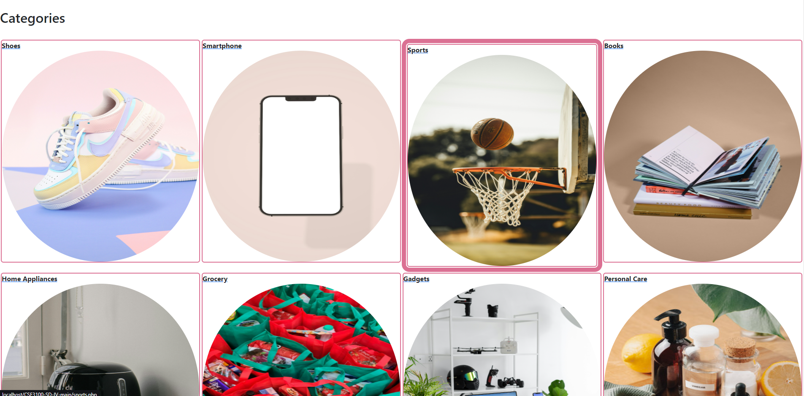

# 🛒💼 BechaKena - E-Commerce and Auction Platform

<div align="center">


[](https://www.php.net/)
[](https://www.mysql.com/)
[](https://opensource.org/licenses/MIT)
[](http://makeapullrequest.com)

[View Demo](https://youtu.be/JnbI_pToNd4) | [Report Bug](https://github.com/naeembeg/CSE3100-SD-IV/issues) | [Request Feature](https://github.com/naeembeg/CSE3100-SD-IV/issues)

</div>

## 📖 Table of Contents
- [About The Project](#about-the-project)
  - [Built With](#built-with)
- [Features](#features)
- [Getting Started](#getting-started)
  - [Prerequisites](#prerequisites)
  - [Installation](#installation)
- [Usage](#usage)
- [Project Structure](#project-structure)
- [Contributing](#contributing)
- [License](#license)
- [Contact](#contact)
- [Acknowledgements](#acknowledgements)

## 🚀 About The Project

BechaKena is a dynamic e-commerce platform that seamlessly integrates auction capabilities with traditional online shopping functionalities. Users can place bids, win auctions, and manage their orders all within a sleek, modern interface.

### Built With
- 🖥️ PHP
- 🎨 HTML/CSS
- 💻 JavaScript
- 🗄️ MySQL

## ✨ Features

- 🔐 **User Authentication**: Secure login and registration system
- 👤 **Profile Management**: Update personal information and profile picture
- 🏷️ **Auction and Bidding**: Participate in auctions and view bidding history
- 📦 **Order Management**: View and manage orders
- 📊 **Dashboard**: Insights into bids, winning bids, and credits

## 🏁 Getting Started

To get a local copy up and running, follow these simple steps.

### Prerequisites

- PHP 7.4+
- MySQL 5.7+
- XAMPP (for easy setup)

### Installation

1. Clone the repository
   ```sh
   git clone https://github.com/naeembeg/CSE3100-SD-IV.git
   ```
2. Move the project folder to your XAMPP `htdocs` directory
   ```sh
   mv CSE3100-SD-IV C:/xampp/htdocs/
   ```
3. Start XAMPP and ensure both Apache and MySQL services are running
4. Create a new database in phpMyAdmin
5. Import the provided SQL scripts to set up the database schema
6. Configure the database connection in `db_connection.php`
7. Access the project through your browser
   ```
   http://localhost/CSE3100-SD-IV
   ```

## 💻 Usage

### Next Auction Countdown
The `next_auction.php` page features a dynamic countdown timer for upcoming auctions, building anticipation and engagement.

### My Orders
Users can easily track their order history through the `my_orders.php` page, which provides comprehensive order details.

### Profile Management
The profile section allows users to personalize their experience and keep track of their platform activities.

## 📁 Project Structure

```
bechakena/
│
├── public/           # Public-facing files
├── includes/         # PHP includes (headers, footers)
├── css/              # Stylesheets
├── js/               # JavaScript files
├── images/           # Image assets
├── db_connection.php # Database configuration
├── next_auction.php  # Auction countdown page
└── my_orders.php     # Order history page
```

## 🖼️ Screenshots

<div align="center">
  
  
</div>

<div align="center">
  
  
</div>

## 🎥 Screencast

Get a comprehensive overview of BechaKena's features in our [project demonstration video](https://youtu.be/JnbI_pToNd4).

## 📄 Project Report

For an in-depth look at the project's architecture and implementation, check out our [detailed project report](https://docs.google.com/document/d/1qQZ7OB776RMVo-fUZHDa9EsAtNwmc3TJ/edit?usp=sharing&ouid=109137004160820100145&rtpof=true&sd=true).

## 🤝 Contributing

Contributions are what make the open-source community such an amazing place to learn, inspire, and create. Any contributions you make are **greatly appreciated**.

1. Fork the Project
2. Create your Feature Branch (`git checkout -b feature/AmazingFeature`)
3. Commit your Changes (`git commit -m 'Add some AmazingFeature'`)
4. Push to the Branch (`git push origin feature/AmazingFeature`)
5. Open a Pull Request

## 📜 License

Distributed under the MIT License. See `LICENSE` for more information.

## 📞 Contact

Mirza Naeem Beg - [mirzanaeem278@gmail.com](mailto:mirzanaeem278@gmail.com)

Project Link: [https://github.com/naeembeg/CSE3100-SD-IV](https://github.com/naeembeg/CSE3100-SD-IV)

## 🙏 Acknowledgements

- [XAMPP](https://www.apachefriends.org/)
- [PHP](https://www.php.net/)
- [MySQL](https://www.mysql.com/)
- [Font Awesome](https://fontawesome.com)
